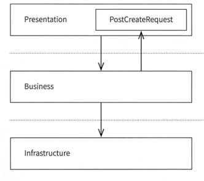

# 1부 객체지향

- 객체지향에서는 복잡한 문제를 역할과 책임에 따라 '개별 객체'로 분해
- 분해된 각기 다른 특성과 기능의 객체들이 상호작용하고 협력해 문제를 해결

## 01 절차지향과 비교하기

- 자바를 사용하면서도 절차지향적인 코드가 나올 수 있다.

### 절차 지향 (Procedure oriented programming)

- 순차지향 = 어셈블리어, 절차지향 = C언어
- 컴퓨터 공학에서 말하는 Procedure는 '함수'를 가리킴
- -> 절차 지향프로그래밍은 함수 지향 프로그래밍이다 !
- -> 자바를 사용해도 함수 위주의 사고방식은 절차지향 패러다임으로 개발하고 있는 것
- 클래스와 객체들이 함수를 실행하기 위한 데이터로서 존재하는 것은 절차지향.
- 모든 비즈니스 로직이 서비스 컴포넌트에 들어있는 것도 절차지향
- -> 비즈니스 로직을 객체가 처리하도록 변경해야한다.

# 2부 객체의 종류

## VO - 값 객체

### 소프트웨어에서 값

- > 객체를 값으로 만들기 위한 특징들.
- 불변성 : 값은 변하지 않는다. 숫자 1은 영원히 숫자 1이다.
- 동등성 : 값의 가치는 항상 같다. 숫자 1은 위치나 시간에 관계없이 숫자 1 이다.
- 자가검증 : 값은 그 자체로 올바르다. 1은 사실 1.01 이지 않을까 같은 고민을 할 필요가 없다.

#### 불변성

##### 불변성 - 값이 변하지 않아야함

- 자바에서 값이 변하지 않게 하기 위해서 final 키워드
- -> VO는 불변이어야하므로 객체가 생성된 이후 거기에 내재된 값이 변경되면 안된다. -> 모든 멤버변수 final
- --> 하지만 모든 멤버변수가 final로 선언되어 있으면 VO다는 틀린 답변
- --> 원시타입이 아닌 final 참조 타입의 변수는 불변이 보장되어 있지 않기 때문.
- -> 불변 객체 안의 **참조 객체가 불변이 아니라면 그 객체는 불변이 아니다!**

##### 불변성 - 함수 또한 불변이어야함(순수함수)

- VO의 멤버변수와 마찬가지로, VO의 모든 함수도 순수 함수여야함
- 순수함수 : 입력값이 같을 때 항상 같은 값을 반환하는 함수 -> 불변성이 적용된 함수 (random 같이 변하는 결과가 나오면 안된다.)

##### 상속으로 변경되면 안됨 (final 클래스)

- 불변으로 설계한 클래스를 상속한 클래스가 불변이 아니면 불변성이 깨지게 된다
- -> final 로 상속을 금지시켜야한다.

#### 불변성을 100% 충족시키기는 어렵다

- 중요한것은 불변성이 지닌 가치를 좇는 것
- -> 불변성의 원래 목표인 **객체를 신뢰하게 만드는 게 중요**하다
- -> 다른 객체와 협력하는 과정에서 항상 예측 가능한 방식으로 동작.

#### 가변 객체는 메서드 호출 결과를 예측할 수 없다

- 가변 객체에서는 다른 스레드 때문에 한 객체의 값이 계속해서 변경될 가능성이 있음
- -> final로 멤버변수 선언하고, 기존 일반 세터 메서드를 변경 시 새로운 객체를 반환하는 메서드로 변경한다.

### 동등성

- 동등성 : 어떤 객체가 값이고 상태가 모두 같다면 같은 객체로 봐야한다.
- -> VO로 만들기 위해 equals나 hashCode 오버라이딩 필요함.
- VO에 식별자를 넣으면 안된다. -> 동등성과 식별자의 논리 충돌.

```
AccountInfo account1 = new AccountInfo(1, 20000);
AccountInfo account2 = account1.withMileage(70000);
account1 == account2 // ?? -> 식별자는 키로 동등성 비교하려고 하고 VO는 값으로 동등성 비교하려고 하므로 논리가 출동한다
```

### 자가검증

- 클래스 스스로 상태가 유효한지 검증할 수 있음을 의미함
- -> 유효하지 않은 상태의 객체가 만들어질 수 없다는 것을 의미.
- -> 따라서 **VO의 생성자에 반드시 유효한 상태의 값이 들어오는지 검증하는 코드가 있어야한다.**
- -> 자가검증이 없다면 VO를 사용하면서도 외부에서 일일이 if문으로 감싸서 예외를 처리해야한다. -> 신뢰를 할 수 없는 객체.

## DTO

- DTO는 그저 데이터를 하나 하나 일일이 나열해서 전달하는 게 불편해서 데이터를 하나로 묶어서 보내려고 만든 객체일 뿐이다.
- DTO 오해 1 - DTO는 프로세스, 계층간 데이터 이동 시 사용된다.
- DTO 오해 2 - DTO는 게터 세터를 갖고 있다.
- DTO 오해 3 - DTO는 데이터베이스에 데이터를 저장하기 위해 사용되는 객체다.

## 엔티티

### 도메인 모델

- 도메인 모델은 어떤 도메인 문제를 해결하고자 만들어진 클래스 모델
- 도메인 모델 안에 도메인 엔티티, 도메인 VO, 도메인 DTO, 도메인 DAO가 포함된다.
- 은행 도메인 모델 예시 : Account, Transaction, Money
- -> 이때 Account, Transaction은 도메인 '엔티티'라고 할 수 있다.

#### 도메인 엔티티

-
    1. 식별 가능한 식별자를 갖는다.
-
    2. 비즈니스 로직을 갖는다.

### DB 엔티티

- 도메인 엔티티와 관계없이 DB 분야에서 어떤 유무형의 객체를 표현하는데 사용했던 유형
- "데이터베이스 분야에서 개체 또는 엔티라고 하는 것은 데이터베이스에서 표현하려고 하는 유형, 무형의 객체로써 서로 구별되는 것을 뜻한다."

### JPA 엔티티

- JPA엔티티는 도메인 엔티티와 DB 엔티티 중 DB 엔티티에 가깝다고 할 수 있음
- 엔티티를 JPA 엔티티라고만 인식하는 개발자는 관계형 데이터베이스에 종속되는 프로그램을 만들 가능성이 크다.

# 3부 행동

- 데이터 지향 VS 행동 지향
- -> **행동 위주 사고**가 객체지향에 유리하다 -> 객체는 서로 협력해야하기 때문에.
- 데이터로는 객체를 정의하기 어렵지만 행동을 보면 객체를 정의하기 쉽다.
- 행동을 고민하는 것은 자연스럽게 역할을 고민하게 만든다

## 덕타이핑

- 행동이 같다면 같은 클래스이다.
- 행동 -> 역할 -> 객체 (행동이 역할을 정의하고, 역할이 객체를 정의한다.)

## 행동과 구현

- 구현을 고민하면 속성이 생기기 마련이다.
- -> 행동을 고민할 때 구현이나 알고리즘을 고민해선 안된다.
- -> 행동을 고민하는 순간엔 순수하게 이 클래스에 어떤 동작을 시킬 수 있을지 고민
- -> 인터페이스
- 인터페이스에는 행동을 어떻게 시킬지만 선언할 수 있기 때문에 개발자는 메시지를 전달하는 방법에만 신경 쓸 수 있다.
- -> 시스템을 개발하는 초기 팀원이 역할과 행동으로 인터페이스를 정의하고, 객체들이 어떻게 협력할지 합의한다면 구현 단계부터 병렬작업이 가능해진다.
- cf) default 메서드는 인터페이스 목적에 반하는 것. default 메서드는 버전 호환성을 위한 것.
- -> enum과 record에 어떻게 공통된 메서드를 사용하냐는 질문에 사용 목적이 잘못된것이라고 인프런 답변 받음..

## 인터페이스

- 행동이 곧 인터페이스는 아니다! 인터페이스와 행동은 다르다..
- 인터페이스란 **'나를 조작하고 싶다면 이런 메시지를 보내면 된다'**라고 외부에 알려주는 수단이다
- 자바의 인터페이스는 어떤 객체를 어떻게 사용하면 되는지 외부세계에 알려주는 것
- -> 행동들의 집합!
- -> 인터페이스는 협력을 위한 창구이며 협력을 위해 객체들은 인터페이스를 통해 메시지를 주고 받는다.
- 인터페이스의 메서드는 private이 불가능하고 public이 기본적으로 설정된다. -> 외부 소통 용도이기 떄문에 private 있을 필요가 없음!
- -> 자바 9부터 문법적으로 private 가능하긴 함
- 구현에 집중한 코드는 요구사항에 유연하게 대처할 수 없다
- -> 반복적이고 의식적으로 객체가 어떤 행동을 하는지 고민해야한다.
- -> 더 나아가 어떤 행동들을 모아 구조적으로 타당한 역할을 만들 수 있을지 고민해야한다.

## 메서드

- 객체는 협력 객체에 메시지를 보내고 협력 객체는 메시지를 수신하는 행동을 한다
- 실제 인터페이스를 통한 호출에서는 어떤 메서드가 호출될지 모른다.

```java
class User {
    void ride(Vehicle vehicle) {
        // 실제 실행되기 전까지 어떤 Vehicle의 ride()가 호출될지 모른다. !!
        vehicle.ride();
    }
}
```

- 코드가 실행되기 전까지 어떤 메서드가 호출될 지 알 수 없다. -> 함수 != 메서드인 이유
- 함수의 개념 : 입력값과 출력값의 대응관계를 나타냄. 함수의 각 입력값은 정확히 하나의 출력으로 대응된다.
- -> 함수는 같은 입력에 대해 같은 출력을 할 수 있어야함.
- 하지만 반대로 객체지향에서는 특정 구현에 의존하는 상황을 피하고자 함
- -> 객체지향에서 협력 객체에 어떤 일을 요청할 때 '함수를 실행한다'라는 말 대신에 **'메시지를 전달한다'**라고 표현하는 이유!
- -> 실제로 어떤 방법으로 일을 처리할지는 객체가 정함.
- --> 객체지향에서 진자 중요한 것은 책임을 나누고 협력관계를 구축하는것.

# 4부 SOLID

- 설계 관점에서 코드의 유지보성을 판단할 때 사용할 수 있는 실무적 세가지 맥락
- 1 영향범위 : 코드 변경으로 인한 영향 범위가 어떻게 되는가?
- 2 의존성 : 소프트웨어의 의존성 관리가 제대로 이뤄지고 있는가?
- 3 확장성 : 쉽게 확장 가능한가?
- -> SOLID는 이 질문에 답을 주는 원칙임

## 단일 책임 원칙 (SRP: Single Responsibility Principle) -> 액터의 관점으로 지킬 수 있음

- 클래스에 너무 많은 책임이 할당되선 안되며 단 하나의 책임이 있어야함.
- -> 클래스가 하나의 책임을 갖고 있을 때 변경이 쉽다.
- 복잡하고 책임이 과한 클래스는 코드를 변경하고자할 때 문제가 됨 -> 영향 범위를 알 수 없으니 코드 변경 자체가 어려움
- -> 단일 책임 원칙은 변경과 연관됨
- --> 변경으로 인한 영향 범위를 최소화 하는 것이 목

### 단일 책임 원칙이 말하는 책임이란?

- 책임은 문맥을 포함하는 개념
- 책임은 그것을 바라보는 개인이나 상황마다 다르게 해석될 가능성이 있음
- -> 하나의 모듈은 하나의 **액터**에 대해서만 책임져야 한다.

#### 액터

- 액터는 메시지를 전달하는 주체 (기능(모듈, 클래스)를 사용하는 주체)
- 단일 책임에서 말하는 책임은 **액터에 대한 책임**
- **메시지를 요청하는 주체가 누구냐**에 따라 책임이 달라질 수 있음
- -> 시스템에서 어떤 모듈이나 클래스를 사용하게 될 **액터가 몇 명인지** 먼저 확인해야한다.
- -> 같은 코드일지라도 시스템에 따라 액터가 다를 수 있다.
- 어떤 모듈이나 클래스가 담당하는 **액터가 혼자라면 단일 책임 원칙을 지키고 있는 것**
- 어떤 모듈이나 클래스가 담당하는 **액터가 여럿이라면 단일 책임 원칙을 위배하는 것**
- -> 단일 책임 원칙을 이해하려면 시스템에 존재하는 액터를 먼저 이해해야한다. 그러기 위한 문맥과 상황이 필요함.
- -> 버그나 성능 개선을 제외하고, **클래스를 변경할 이유는 하나. -> 액터의 요구사항이 변경**될 때

## 개방 폐쇄 원칙 -> 역할에 의존하는 것으로 지킬 수 있음

- "확장에는 열려있고 변경에는 닫혀있다."
- -> 추상화된 역할에 의존한다. 로 달성하기
- 클래스의 동작을 수정하지 않고 확장할 수 있어야한다.
- 구현에 의존하는 코드를 작성하면 새로운 요구사항이 생겼을 때 해당 요구사항을 지원할 수 있도록 코드 변경이 발생하게 됨
- 역할에 집중. 간접적으로 구현체를 사용하면 기존 코드 변경 없이 요구사항 추가가 가능

```java
class Example {
    public static void main(String[] args) {
        Calculable food = new Food();
        Order order1 = new Order(food);
        order1.calculate();

        Calculable drink = new Drink();
        Order order2 = new Order(drink);
        order.calculate(); //새로운 요구사항 -> 음료에 대한 주문이 추가되었을 때 기존 코드 변경없이 추가 가능.
    }
}
```

## 리스코프 치환 원칙 -> 인터페이스는 계약이다. 계약은 테스트 코드로 지킬 수 있다.

- "파생 클래스는 기본 클래스를 대체할 수 있어야 한다."

```java

@Setter
@AllArgsConstructor
public class Rectangle {
    private long width;
    private long height;

    public long calculateArea() {
        return width * height;
    }
}

public class Square extends Rectangle {
    public Square(long length) {
        super(length, length);
    }
}

public class Main {
    public static void main(String[] args) {
        Square square = new Square(10);
        square.setWidth(5);
        square.calculateArea(); //25를 기대했지만 50이 출력됨 !
    }
}
```

- 해당 상속관계에서 Square 객체에서 calculateArea()를 호출하면 예상하지 못한 결과가 나올 수 있음
- -> 파생 클래스가 기본 대체를 하지 못하는 리스코프 치환원칙 위반 예시
- -> setter 메서드를 오버라이딩해도 기본 클래스의 의도를 위반한 것일 수도 있기 떄문에 좋지 않다.

```java
public class Square extends Rectangle {
    public Square(long length) {
        super(length, length);
    }

    @Override
    public setHeight(long length) {
        width = length;
        height = length;
    }
}

public class Example {
    // setHeight를 수정하면 width도 같이 반영되도록 오버라이딩 한 것에서 버그 발생 
    public void functionExam(Rectangle rectangle) { //Square 객체가 인자로 전달됨
        rectangle.setHeight(100);
        System.out.println(rectangle.getWidth()); //100
        rectangle.setHeight(50);
        System.out.println(rectangle.getWidth()); //50 --> width도 같이 수정되는것은 Rectangle의 의도 위반
    }
}
```

- 코드 작성자의 의도를 파악하면서 파생 클래스를 작성하기 어렵다
- -> 초기 코드 작성 시 작성자가 생각하는 모든 의도를 테스트 코드로 만들어두면 의도 파악이 가능해진다.
- -> 파생 클래스 작성 후 테스트 코드 적용해볼 수 있게 됨
- --> **인터페이스는 계약이며, 테스트 코드는 계약 명세**이다.

## 인터페이스 분리 원칙 (ISP : Interface Segregation Principle) -> 기능적 응집도를 추구하라

- "클라이언트 별로 세분화된 인터페이스를 만들어야한다."
- 클라이언트가 자신이 사용하지 않는 인터페이스에 의존하지 않아야한다는 원칙.
- -> 어떤 클래스가 자신에게 필요하지 않은 인터페이스의 메서드를 구현하거나 의존하지 않아야한다는 것.
- 이 원칙은 개발자가 하나의 인터페이스로 모든 것을 해결하고자 할 때 위배된다.
- 세분화된 인터페이스 예시코드

```java
public class LifecycleBean implements
        BeanNameAware,
        BeanFactoryAware,
        InitializationBean,
        DisposableBean {
    //..
}

public class AnnotationBeanConfigurerAspect
        extends AbstractInterfaceDrivenDependencyInjectionAspect
        implements BeanFactoryAware, InitializationBean, DisposableBean { // 위와 비교했을 경우 BeanNameAware이 빠져있음
    //..
}
```

- 통합된 인터페이스는 구현체에 불필요한 구현을 강요할 수 있음
- 범용성을 가진 하나의 인터페이스를 만들기보다 다수의 특화된 인터페이스를 만드는 편이 낫다.

### 통합된 인터페이스 단점 - BeanAware와 BeanNameAware 예시

- 인터페이스의 역할이 두루뭉술해짐
- 스프링에서 Aware : Aware가 포함된 인터페이스는 앞에 나온 타깃에 변화가 있을 때 실행되는 콜백 메서드를 구현하는 사용됨.
- ex) BeanNameAware는 bean 이름과 관련된 활동이 있을 때 실행되는 콜백 메서드를 구현.
- -> BeanAware로 통합할경우 인터페이스의 정의가 지나치게 넓어져 여러 액터들을 상대하게 되고, 단일 책임 원칙을 위반하게 될 수 있음
- 인터페이스를 통합하면 응집도가 높아지는 것이 아닌가?
- -> 응집도를 추구하는 행위일 수 있으나 응집도를 높히는 것은 아니다
- 기능적 응집도 > 순차적 응집도 > 통신적 응집도 > 절차적 응집도 > 논리적 응집도  (항상 응집도 순위가 맞는건 아님)
- > 인터페이스 통합 등의 **유사한 코드라서 한 곳에 모아놓자는 논리적 응집도이며 낮은 수준의 응집도 추구일 수 있음**
- **인터페이스 분리 원칙은 역할과 책임을 분리하고 역할을 세세하게 나누라는 의미 **
- -> **인터페이스 분리 원칙은 기능적 응집도를 추구**
- 객체지향에 익숙하지 않은 우리들은 본능적으로 데이터 위주의 사고하고 비슷한 것을 하나로 묶어 싶어 함
- 하지만 원칙과 효율성 타기에서 줄타기를 잘해야한다.

## 의존성 역전 원칙 (Dependency Inversion Principle) - 하위모듈이 상위모듈에 의존하게 하여 상위 모듈의 재사용성을 높힌다.

- 구체화가 아닌 추상화에 의존해야한다.
- 1 고수준 모듈은 추상화에 의존해야한다.
- 2 고수준 모듈이 저수준 모듈에 의존해서는 안된다.
- 3 저수준 모듈은 추상화를 구현해야한다.
- 의존 예시 코드

```java
// Printer 클래스가 Book 클래스를 사용한다.
class Printer {
    public void print(Book book) { //의존
        //..
    }
}

// Book 클래스가 Writer 클래스를 사용한다.
class Book {
    private String content; //의존
    private Writer writer; //의존
    //..
}

// Car 클래스가 Vehicle 인터페이스를 사용한다.
class Car implements Vehicle {
    //..
}
```

- 특정 클래스를 사용하기만 해도 의존이다.

### 의존성

- 의존성은 객체들의 협력
- -> 약화시킬 수는 있어도 완전히 제거할 수는 없다.
- new 키워드를 사용한 결합은 Content Coupling에 해당하는 결합이며 정보 은닉이라는 설계 목적을 위반한 것.
- -> **상세한 구현 객체에 의존하는 것은 피하고 구현 객체가 인스턴스화되는 시점을 최대로 미루라는 것**.
- 의존성 주입은 프레임워크 없이 가능하다.

### 의존성 역전

- 의존성 주입과 의존성 역전은 다르다
  

```java
class Restaurant {
    Food serve() {
        return new HambergerChef().make();
    }
}
```


- 상위 인터페이스를 만들고 기존의 두 클래스가 인터페이스에 의존하게 변경
- 의존성 역전 : 추상화를 이용한 간접 의존형태로 바꾼다.

```java
class Restaurant {
    Food serve(Chef chef) {
        return chef.make();
    }
}
```

- HambergerChef 클래스 입장에서 의존을 당하던 상황에서 의존을 하는 상황으로 의존성 역전됨

#### 의존성 역전이 경계를 만든다.

- 하위 클래스가 의존관계로 의존하는 인터페이스가 경계가 된다.
- -> 경계를 기준으로 모듈을 나눌 수 있다. 모듈의 상하관계를 파악할 수 있게 된다.
  
- hamburger 모듈은 restaurant 모듈을 사용하게 됨 (impl)
- -> restaurant 모듈은 hamburger 모듈을 사용하지 않음
- -> restaurant 모듈은 상위 모듈, hamburger 모듈은 하위 모듈
- -> 시스템을 설계할 때 상위 모듈은 하위 모듈에 의존하게 해서는 안된다.
- -> 모듈의 상하관계를 나누고 하위모듈이 상위모듈을 바라보게 만듦으로써 rastaurant같은 상위 모듈의 재사용성을 높힐 수 있다.
- 상위 모듈은 하위 모듈에 의존해선 안된다. 상위 모듈과 하위 모듈 모두 추상화에 의존해야한다.
- 추상화는 세부사항에 의존해서는 안된다. 세부사항이 추상화에 의존해야한다.
- 로버트 C 마틴은 클린아키텍처에서 의존 역전 원칙에 대해 '자바 같은 정적 타입 언어에서는 import 구문에 오직 인터페이스나 추상클래스 같은 추상선언만 있어야한다' 라고 함

#### 스프링과 의존성 역전 원칙

- 스프링은 의존성 주입을 지원하는 프레임워크
- 스프링이 의존성 역전 원칙을 지원하는 프레임워크는 아니다. -> 의존성 역전 원칙은 설계 부분에서 개발자들이 능동적으로 신경 써야하는 부분.
- 의존성 역전 원칙이 지켜진 저자가 제안하는 아키텍처
  

#### 유지보수을 판단할 때의 세 가지 맥락

- 영향 범위 : 코드 변경으로 인한 영향 범위가 어떻게 되는가?
- -> 영향 범위에 문제가 있다면 응집도를 높이고 적절히 모듈화해서 **단일 책임 원칙**을 준수하는 코드를 만들기
- 의존성 : 소프트웨어에서 의존성 관리가 잘 이루어지고 있는가?
- -> 의존성에 문제가 있다면 **의존성 주입과 의존성 역전 원칙**등을 적용해 약한 의존관계를 만든다.
- 확장성 : 쉽게 확장이 가능한가?
- -> 확장성에 문제가 있다면 의존성 역전 원칙을 이용해 **개방 폐쇄 원칙**을 준수하는 코드로 만든다.

#### 의존성 전이와 의존성 끊기

- 객체 간의 협력과 시스템 간의 협력이 곧 의존성
- 의존성을 제거할 순 없지만 끊을 수는 있다.

##### 의존성 전이


- 의존성은 컴포넌트 간 상호작용이므로 한 컴포넌트가 변경되거나 영향을 받으면 관련 컴포넌트에 영향을 줄 수 있음
- -> 이를 의존성 전이라고함
- -> 의존성은 화살표의 역방향으로 전이됨.
  
- 인터페이스를 두고 의존성을 역전시키면 컴포넌트의 변화에도 다른 컴포넌트에 영향을 주지 않는다.
- -> 변경으로 인한 영향 범위 최소화
- 의존성 역전을 사용했다 or 추상화를 적용했다 -> 변경으로 인한 영향 범위를 최소화 했다
- -> 의존성 역전은 경계를 만드는 기술. 코드가 변경되더라도 경계 밖으로 영향이 가지 않게 만든다.

#### 순환참조

- 의존성에 관한 소프트웨어 격언 : 순환참조를 만들지 마라
- -> 순환참조는 의존성 전이의 영향범위를 확장시키는 주범
- -> 순환참조를 만들지 않으려면 양방향 참조를 끊어내고 단방향으로 만들어야함.
- -> 모든 의존 방향을 단방향으로 만들어 문제가 발생했을 때 원인이 어디인지 추적 가능하게 만들어야함.
- 순환참조는 사실상 같은 컴포넌트라는 선언이다.
- 순환 의존하는 컴포넌트 끼리 컴포넌트 영향 범위가 같아지기 때문

#### 디자인 패턴

- 의식적으로 디자인 패턴을 적용하지 않아도, 모듈의 경계를 나누고 의존관계를 정리하고 순환참조를 없애다 보면 자연스럽게 디자인 패턴이 적용됨
- 의존성을 고민하지 않고 디자인 패턴을 적용하긴 어려움
  
- 의존성을 고려하여 어댑터 패턴을 분석하면 Target 같은 인터페이스를 생성한 설계를 이해할 수 있게 됨
- -> 설계자는 클라이언트와 어댑터 사이의 연결을 끊고 싶었음
- -> 클라이언트가 어댑터에 의존하는 상황을 피하고 싶었음
- -> 어댑터가 변경되도 클라이언트의 코드가 변경되지 않길 원함
- -> 추상화를 통해 클라이언트 코드의 재사용성을 높임
- --> **의존성 역전은 실제로 포트-어댑 패턴이라고도 불림**
- 디자인 패턴을 공부할 때 의존 그래프를 파악하고 변경으로 인한 영향을 받는 범위가 어디까지 인지 공부하는 것이 중요

# 5장 순환참조

- 두개 이상의 객체나 컴포넌트가 서로를 참조함으로써 의존관계에 사이클이 생기는 상황

```java

@Data
class Team {
    private long id;
    private String name;
    private List<Member> members;
}

@Data
class Member {
    private long id;
    private String name;
    private Team myTeam;
}
```

- 팀과 팀원의 관계를 표시한 클래스 -> 순환참조임

## 양방향 매핑

- JPA Entity의 양방향 매핑은 순환참조다.

## 순환참조의 문제점

### 무한루프

- **순환참조가 있다는 것은 무한 루프가 발생할 수 있다**는 것임.

### 시스템 복잡도

- 순환참조는 시스템의 복잡도를 높임. (의존성 전이 등)
- "팀내 모든 구성원의 월급을 합산해주세요 라는 요구사항이 있을 떄"

```java

@Data
class Team {
    private long id;
    private String name;
    private List<Member> members;
}

@Data
class Member {
    private long id;
    private String name;
    private Team myTeam;

    // 팀 내 모든 팀원의 월급의 합을 반환함
    public int calculateTeamMemberTotalSalary() {
        int result = 0;
        for (Member member : myTeam.getMembers()) {
            result += member.getSalary();
        }
        return result;
    }
}
```

- 위 코드는 팀원이 팀 내 전체 구성원의 월급을 알 수 있는 시스템. 현실세계에서는 벌어질 수 없는 이상한 상황.
- -> 잘못된 설계로 인해 이러한 **이상한 코드가 만들어질 수 있는 구조**가 되는 것이 문제 !
- -> 의미상으로 그렇게 되어서는 안되는 코드는 컴파일 타임에 만들어지지 않게 하는 것이 좋다..

```java
// 하위 객체에서 식별자를 통한 간접 참조로 변경
@Data
class Team {
    private long id;
    private String name;
    private List<Member> members;
}

@Data
class Member {
    private long id;
    private String name;
    private int myTeamId; // 애초에 이상한 개발을 하지 못하도록 ..
}
``` 

```java
// 혹은 상위 객체에서 참조를 제거
@Data
class Team {
    private long id;
    private String name;
//    private List<Member> members;
}

@Data
class Member {
    private long id;
    private String name;
    private Team myTeam;
}

//"팀내 모든 구성원의 월급을 합산해주세요 라는 요구사항이 있을 떄"
//요구사항은 서비스에서 구현
@Service
@RequriedArgsConstructor
class TeamService {
    private final MemberService memberService;

    public long getTeamSalary(long id) {
        return memberService.findByTeamId(memberId).steam()
                .mapToLong(Member::getSalary)
                .sum();
    }
}
```

- 순환참조가 있으면 어떤 객체에 접근할 수 있는 접근 경로가 너무 많아짐.

## 순환 참조를 해결하는 방법

### 불필요한 참조 제거

- 꼭 필요하지 않은 참조를 제거하거나 한쪽이 식별자를 갖게 하는 간접 참조로 바꾸기

### 간접 참조 활용

- 식별자를 갖고 있는 방식

### 공통 컴포넌트 분리


- 양쪽 서비스에 있던 공통 기능을 하나의 컴포넌트로 분리
- -> 공통 기능을 분리하는 과정에서 책임 분리가 적절하게 재조정된다.

### 이벤트 기반 컴포넌트 사용

- 서비스를 공통 컴포넌트로 분리할 수 없다면 이벤트 기반 프로그래을 시스템에 적용

### 양방향 매핑

- 양방향 매핑은 순환참조 -> 왜 존재하는 것일까?
- -> 양방향 매핑은 어쩔수 없이 존재하는 도메인 문제에 최소한으로 적용하는게 바람직.

## 상위 수준의 순환참조

- 순환참조는 객체 뿐만아니라 패키지나 시스템 수준에서도 발생할 수 있는 문제

# 6장 - 안티패턴

## 안티패턴 1 - 스마트 컨트롤러

- 백엔드 개발자의 UI는 API
- 스마트 UI는 백엔드 관점에서 스마트 컨트롤러
- 스마트 UI는 어떤 스크립트를 실행하고 응답하는 수준의 역할만 한다.

## 안티패턴 2 - 양방향 레이어드 아키텍처 <- 순환 참조임

- 레이어드 아키텍처 : 인프라스트럭처 레이어에는 영속성 컴포넌트 뿐만아니라 WebClient 관련 컴포넌트가 배치되기도 함
- 레이어드 아키텍처 장점 : 단순하고 직관적임
- 레이어드 아키텍처의 레이어간 의존 방향은 단방향을 유지해야함.

### 양방향 레이어드 아키텍처 예시

- 하위 레이어가 상위 레이어에 존재하는 모델을 편의상 참조함 (순환 참조)
- -> 프레젠테이션 레이어가 비즈니스 레이어를 참조하고, 비즈니스 레이어도 프레젠테이션을 참조 하는 것

```java

@Service
@RequiredArgsConstructor
public class PostService {

    public void create(PostCreateRequest request) { // API 요청 받는 모델인데 비즈니스 레이어에서 사용 중 (순환 참조)
        //..
    }
}
```



- 프리젠테이션 레이어와 비즈니스레이어에 양방향 의존관계가 생긴 것!
- -> 양방향 레이어드는 사실상 레이어가 아닌 폴더 수준.

### 순환 참조 해결방안 모색 1 - 레이어별 모델 구성

- 프레젠테이션 레이어 모델과 비즈니스 레이어 모델을 둘 다 작성하기

```java

@Data
public class PostCreateRequest {
    private String title;
    private String content;

    public PostCreateCommand toPostCreateCommand(long writerId) {  //상위가 하위 참조는 가능
        return PostCreateCommand.builder()
                .title(title)
                .content(content)
                .writerId(writerId)
                .build();
    }
}

@Data
@Builder
public class PostCreateCommand {
    private String title;
    private String content;
    private Long writerId;
}

@Service
@RequiredArgsConstructor
public class PostService {
    public void create(PostCreateCommand command) { // 하위가 상위를 참조하는 것을 없앰!
        //..
    }
}
```

- cf) 코드 중복과 코드 유사성
- -> 코드가 유사하다고 중복인 것은 아니다. -> 역할, 책임, 구현 등이 비슷할 때 중복이라고 하는 것.
- -> 몇몇 변수가 겹친다고 데이터 모델을 어정쩡하게 공유하는 것보다 역할과 책임에 따라 확실히 모델을 구분하는 편이 낫다.

### 순환 참조 해결 방안 모색 2 - 공통 모듈 구성 (애매함 -> 모듈 != 레이어)

- PostCreateRequest를 공통 모듈로 구성하여 모든 레이어가 이곳을 의존하도록 변경한다면?
- -> 공통 모듈로 분리한다는 전략은 범용적으로 사용할 수 있는 유틸성 클래스를 한 곳에 모아둘 때 유용함.
- -> 하지만 **공통 모듈은 공통으로 참조할 수 있는 모듈을 만드는 것이지 공통된 레이어를 만든다는 말은 아님 !**

## 완화된 레이어드 아키텍처 (안티 패턴)

- 컨트롤러가 레포지토리를 참조해도 될까?
- -> 상위 레이어가 모든 하위 레이어를 직접 참조할 수 있는 구조 -> 완화된 레이어드 아키텍처
- -> 제약이 완화됨 (인접한 하위 레이어만 참조해야한다는 제약)
- -> 하지만 좋지 못함. **일반적으로 레이어를 건너뛰는 것은 안티패턴** --> 스마트 UI가 되는 지름길..
- cf) 코어 모듈은 레이어가 아니므로, 여러 레이어에서 참조되어도 완화된 레이어드가 아니다..

## 트랜잭션 스크립트 (안티 패턴)

- 트랜잭션 스크립트는 비즈니스 레이어에 위치하는 서비스 컴포넌트에서 발생하는 안티패턴임.
- -> 서비스 컴포넌트의 구현이 사실상 '트랜잭션이 걸려 있는 스크립트'를 실행하는 것과 같을 때

## 질문) 비즈니스 로직은 어디에 위치해야할까? -> 답) 도메인 모델

- -> **비즈니스 로직이 서비스 컴포넌트에 위치한다는 말은 반은 맞고 반은 틀림**..
- -> 더 나은 답변은 "**비즈니스 로직은 도메인 모델에 위치**해야한다"(Cafe, Post, Board, User같은 객체들..)
- -> 비즈니스 로직이 처리되는 주 영역은 도메인 모델이어야함. 서비스 컴포넌트가 아님!
- -> 서비스 컴포넌트는 도메인을 불러와서 도메인에 일을 시키는 정도의 역할만 해야함.
- 에플리케이션의 본질은 도메인이다.
- 서비스는 도메인들이 협력할 무대만 제공하고 그 이상의 역할을 하지 않는 게 좋다.
- -> 객체지향과 관련된 내용은 도메인 수준에서 적용! (물론 서비스 컴포넌트나 다른 스프링 컴포넌트에서도 객체지향을 추구하기)
- -> 객체지향 관점에서의 **리포지토리**는 단순히 데이터를 불러오는 것이 아니라 **도메인 객체를 불러오는 곳** !!!

## 객체지향 관점에서의 서비스 코드 동작

- 리포지토리에서 도메인 객체를 불러온다.
- 도메인 객체에게 일을 시킨다
- 리포지토리에 도메인 객체를 저장한다.
- 컨트롤러에 응답한다.

# 7장 - 서비스

- 도메인 서비스가 무엇인지?
- 스프링에서 서비스는 왜 서비스인지?
- 서비스 컴포넌트에 추가적으로 기대하는 역할이나 책임은 무엇인지?

## 서비스의 컴포넌트의 역할 크게 3가지

- 1 도메인 객체를 불러오기
- 2 도메인 객체나 도메인 서비스에 일을 위임하기
- 3 도메인 객체의 변경 사항을 저장하기

## 스프링에서의 Service

### @Service의 자바독 요약

- @Service는 에릭 에반스의 DDD에서 영감을 받아 만들어진 애너테이션
- 서비스는 J2EE 패턴 중 하나인 비즈니스 서비스 파사드처럼 사용될 수 있음

### DDD (도메인 주도 설계)

#### DDD에서 정의하는 '서비스'란?

- DDD에서의 서비스 컴포넌트 (에릭에반스가 한 말)
- -> 자신의 본거지를 **엔티티나 값객체에서 찾지 못하는 중요한 연산**이 있다. 일부는 본질적으로 사물이 아닌 **활동이나 행동**인데
- -> 우리의 모델링 패러다임이 객체이므로 그러한 **연산도 객체와 잘 어울리게끔 노력**해야함.
- 이것이 스프링 서비스
- -> **서비스는 도메인 객체가 처리하기 애매한 '연산'자체를 표현하기 위한 컴포넌트**

#### 로직을 도메인 세상 속 객체에 녹이기 어려운 상황이 있다면?

- ex) 상품(Product), 쿠폰(Coupon), 사용자(User)의 마일리지(Mileage)라는 도메인이 있고
- 가격 = 상품가격 - (상품가격x쿠폰최대할인율)-사용자마일리지
- -> 서비스에 있는 비즈니스 로직을 도메인 객체가 처리하게 만들라 적용해보기

```
user.calculatePrice(cupons, product);
coupon.calculatePrice(user, product);
product.calculatePrice(user, coupons);
```

- 하지만 가격을 계산하는 로직은 모든 도메인 객체가 처리하기 애매함.
- -> 이러한 로직을 능동적인 객체에 표현하는 것 자체가 어렵기 때문
- -> 가격 계산 로직 같은 것은 '연산'-> 객체로 표현되기 어렵고 '계산식'과 같은 형태로 표현되는 것이 오히려 자연스러움.

#### 객체로 표현하기 어려운 '연산' 로직 해결 법 - 새로운 클래스를 만들고 거기에 밀어 넣기

```
@Service
@RequiredArgsConstructor
public class ProductService{
    PriceManager priceManger = new PriceManager(); //서비스가 서비스(매니저)를 호출하는 상황
    priceManager.calculate(user, product, coupons);
}
```

- Manager가 곧 서비스.
- -> 이따금 서비스는 특정 연산을 수행하는 것 이상의 의미는 없는 모델 객체로 가장해서 나타나기도 한다.
- -> 이같은 행위자는 끝에 Manager와 같은 것이 붙는다 (에릭 에반스)
- -> ...Manager가 나오면 접두어에 있는 모델은 관리하는 클래스..
- 마찬가지로 **서비스**도 어떤 모델과 강력하게 **연관돼 있지만 모델과 관련된 부가적인 논리 로직**을 갖고 있는 공간임-

#### 사실 스프링 서비스가 연산이다 (서비스 == 매니저 == 연산)

- 스프링 컴포넌트에서 말하는 서비스도 위에서 알아본 Manager 와 동일하다
- -> 스프링 서비스는 로직 자체가 연산이라서 어떠한 객체도 갖고 있기 힘들어서 만들어진 클래스.
- -> 1. 저장소에서 데이터를 불러온다.
- -> 2. 네트워크 호출 결과를 정리해서 객체에 넘겨준다.
- -> 3. 저장소에 데이터를 저장한다.
- --> 이러한 로직 모두 그 자체로 '연산'. 그래서 이를 도메인 객체에 넣기 어려움.
- 애플리케이션에 꼭 필요하지만 '연산' 그 자체로는 어떠한 객체도 갖고 있기 애매해서 만들어지는 별도의 클래스
- -> Service 또는 Manager임. -> 스프링 서비스 컴포넌트의 정체

#### 서비스가 서비스를 호출한다? (Service->Manager)

- 하나는 스프링 컴포넌트를 이용해서 만든 ProductService
- 하나는 계산 로직을 표현하기 위해 만든 PriceManager
- -> 서비스가 서비스를 실행하고 있음
- -> 양쪽 모두 어떤 도메인 객체로 표현하기 애매한 연산 로직을 모아둔 클래스이지만 성격은 다르다
- -> **PriceManager는 도메인 시스템을 구축**하기 위해 존재
- -> 가격을 계산한다는 점과 가격을 계산하는 **비즈니스 업무 규칙**을 갖고 있으므로 '도메인'에 가까운 로직
- ProductService는 @Service 애너테이션으로 만들어진 ProductService는 **애플리케이션이 돌아가기 위해 필요한 연산**을 갖고 있는 서비스
- -> **어플리케이션의 실행에 초점에 맞춰 개발된 서비스**
- 도메인 개발에 필요하지만 객체로 표현하기 애매한 로직을 처리하는 서비스를 '**도메인 서비스**'라고 한다
- 애플리케이션 개발에 필요하지만 객체로 표현하기 애매한 로직을 처리하는 서비스를 '**애플리케이션 서비스**'라고 함

#### 도메인 vs 도메인 서비스 vs 애플리케이션 서비스

##### 도메인 (도메인 로직)

- 비즈니스 로직을 처리
- 도메인 역할을 수행
- 다른 도메인과 협력
- ex) User, Product, Coupon

##### 도메인 서비스 (도메인 연산)

- 비즈니스(도메인) '연산' 로직을 처리
- 도메인 **협력**을 중재
- 도메인 객체에 기술할 수 없는 연산 로직을 처리
- ex) PriceManager

##### 애플리케이션 서비스 (어플리케이션 연산)

- 애플리케이션 '연산' 로직을 처리
- 도메인을 저장소에서 불러옴
- 도메인 서비스를 실행
- 도메인을 실행
- ex) ProductService

### @Service의 자바독 요약 2

- 'J2EE의 비즈니스 서비스 파사드 패턴처럼 사용할 수 있다'
- -> == 도메인과, 도메인 서비스의 **파사드**처럼 사용할 수 있다.

### 도메인 VS 도메인 서비스

- 위의 도메인 서비스(ProductManager)는 도메인(Cashier)로 발전될 수 있음
- -> 도메인과 도메인 서비스를 구분짓는 것은 행동으로 결정..

## 객제지향 개발자의 서비스 컴포넌트 조언

- **서비스는 가능한 한 적게 만들고, 얇게 유지**해야함
- 서비스보다 **풍부한 도메인 모델**을 만들어야함
- -> 서비스에 있는 비즈니스 로직을 도메인 객체로 옮겨라..!
- -> 서비스 코드를 작성할 때는 현재 작성 중인 코드가 '기존 도메인 객체에 들어갈 수는 없는지'
- -> 혹은 '새로운 도메인 모델로 만들수는 없는지' 고민

### 개발 우선순위

- 도메인 모델 > 도메인 서비스 > 애플리케이션 서비스
- -> 테스트하기 쉽다
- -> 도메인 모델은 도메인 서비스보다 테스트하기 쉽고, 도메인 서비스는 애플리케이션 서비스보다 테스트하기 쉽다.

## 작은 기계 - 서비스 컴포넌트가 생성자 주입해야하는 주된 이유 -> 불변성

- 서비스에 관한 새로운 시각
- -> '한 번 생성하면 여러 번 사용하지만 그 자신은 바꿀 수 없다. 생명주기도 매우 단순하다. 한 번 생성하면 특정 작업을 하는 작은 기계처럼 영원히 실행할 수 있다. 이러한 객체를 서비스라고 함'
- -> 불변성
- 객체로 표현하기 애매한 연산 로직의 집합이 서비스
- 서비스는 어떤 가변 상태를 갖는 객체가 아니라 '계산식'그 자체 -> 그러니 서비스는 불변.
- -> 생성자 주입
- -> 생성자 주입의 주된 이유는 서비스는 원래 불변하기 떄문.

## 서비스 컴포넌트를 위한 행동 조언

- 서비스 멤버변수 모두 final
- 서비스에 세터 지우기
- 서비스 생성자 주입
- 서비스 비즈니스 로직을 도메인에 양보
- 서비스를 얇게 유지

# 8장 레이어드 아키텍처

- 레이어드 아키텍처는 구체적인 사양이 아님.

## 레이어드 아키텍처의 조건 (제약)

- 레이어 구조를 사용 (필수)
- 레이어 간 의존 방향은 단방향 (필수)
- 레이어 간 통신은 인접한 레이어에서만 이뤄지게 함 -> 작가는 필수는 아니라 생각함

### 아키텍처란? - 제약

- 아키텍트들이 아키텍처를 설명할 때 항상 빠지지 않고 말하는 한 가지 특징은 제약조건
- 아키텍처는 제약 조건을 이용해 개발자가 해도 되는 것과 하지 말아야 하는 것을 결정한다.
- 더 나아가, 해서는 안되는 일이 개발 단계에서 일어나지 않게 원천적으로 차단함.

### 제약 - 목적을 달성하기 위한 것

- 제약 조건은 목적에 따라 변경될 수 있음

## 잘못된 레이어드 아키텍처

### JPA 엔티티 우선 접근 개발 방식 vs 엔드포인트 우선 접근 개발 방식

- JPA 먼저 떠올렸다는 것은 DDL을 고민했다는 것 -> 데이터 종속
- -> 데이터 위주의 사고방식의 문제가 동일하게 생김
- 잘못된 레이어드 아키텍처는 레이어를 지나치게 추상화함
- -> 인프라스트럭처 레이어를 먼저 만들면 어떤 문제가 있을까 ?
- API 엔드포인트 우선 접근 -> 스프링 종속
- 시스템을 도메인 요구사항 관점에서 봤다는 것에서 JPA 우선 방식보다는 낫다..
- 하지만 이런 방식은 프레임워크 종속적임
- API 엔드포인트를 고민하는 것은 도메인 요구사항이 무엇인지 파악하는데 도움을 주는 단계 뿐임
- -> 요청 응답형식 먼저 개발하는 것도 데이터 위주의 생각을 할 가능성이 높다.

## 애플리케이션의 본질은 도메인이다

- 애플리케이션을 개발한다는 것은 도메인을 파악하고, 이에 따른 도메인 모델을 구성하고,
- -> 도메인 모델을 표현하는데 적합한 언어를 선택하고, 도메인 모델을 만들고, 도메인 기능을 제공할 기술을 선택한다는 것임.

## 진화하는 아키텍처 - 비즈니스 레이어 -> 어플리케이션 + 도메인 레이어

- 레이어드 아키텍처를 사용하면서도 객체지향을 챙길 수 있음
- -> 시스템 개발의 첫 시작을 도메인으로 두기 !
- 도메인을 개발하려면 비즈니스 레이어 부터 개발하자
- cf) 비즈니스 레이어 = (서비스 컴포넌트 + 도메인..)
- -> 따라서 비즈니스 레이어 중에서도 도메인을 가장 먼저 개발해야함.
- 비즈니스 레이어안에 도메인이 존재해서 인지 모델에 혼란이 발생
- -> 도메인 레이어를 분리하자 : 서비스 레이어 -> (어플리케이션 + 도메인) 레이어
- 프레젠테이션 -> 어플리케이션 -> 도메인 -> 인프라스트럭처 레이어
- **도메인 레이어는 순수 자바 코드로 작성** -> 외부 라이브러리에 의존하지 않고 자유롭게 만들기 위함
- **애플리케이션 서비스는 도메인에 있는 코드를 실행하는 역할은 함!!**
- -> '서비스는 J2EE패턴중 하나인 비즈니스 서비스 파사드처럼 사용될 수 있다'
- -> 애플리케이션 레이어에 위치한 **서비스 컴포넌트는 이제 도메인 레이어의 파사드**가 됐다.

## Account & AccountJpaEntity

- 순수한 도메인 모델과 영속성 객체를 사용하는 애플리케이션 서비스

```java

@Builder
@RequiredArgsConstructor
public class Account {
    public final Long id;
    public final String email;
    public final String nickname;

    public Account withNickname(String nickname) { //불변객체수정
        return Account.builder()
                .is(this.id)
                .email(this.email)
                .nickname(nickname)
                .build();
    }
}

@Service
@RequiredArgsConstructor
public class AccountService {
    private final AccountRepository accountRepository;

    /**
     * 이렇게 되면 서비스 레이어에서 JPA 기능을 사용하지 않는 것..
     */
    @Transactional
    public Account updateNicknameById(long id, String nickname) {
        Account account = accountRepository.findById(id);
        account = account.withNickname(nickname);
        accountRepository.save(account);
    }
}

public interface AccountRepository {
    public Account findById(long id);

    public void save(Account account);
}

@Repository
@RequiredArgsConstructor
public class AccountRepositoryImpl implements AccountRepository {
    private final AccountJpaRepository accountJpaRepository;

    @Override
    public Account findById(long id) {
        return accountJpaRepository.findById(id)
                .orElseThrow(() -> new NotFoundException("account", id))
                .toModel();
    }

    @Override
    @Transactional
    public void save(Account account) {
        accountJpaRepository.save(AccountJpaEntity.from(account));
    }
}
```

- 현재 구조에서는 도메인 레이어가 인프라스트럭처 레이어를 참조하지 않는다
- -> 도메인 레이어는 JPA나 스프링을 임포트하지 않는다.

```
- 개인적인 의견 : 그것은 조회를 비즈니스 로직(도메인 로직)으로 보지 않았을 경우 아닌가? 
- 조회를 복잡한 비즈니스 로직으로 본다면???
- 도메인 모델을 인터페이스로 작성하면 도메인 서비스에서 DB의존하더라도 기술을 의존하지 않을 수 있지 않을까? -> 엔티티의 기능도 살아 있을 거 같은데..
```

## JPA와의 결합 끊기

- 어플리케이션 레이어에 위치한 AccountService 컴포넌트가 인프라스트럭처 레이어 위에 JPA에 의존하는 상황을 제거하기
- 어플리케이션 레이어에서 Repository 라는 인터페이스를 새롭게 배치하기

## 웹 프레임워크와의 결합 끊기

- AccountService를 인터페이스로 -> 헥사고날 아키텍처가 된다.
- 헥사고날 아키텍처는 외부세계를 다루는 방식으로 포트-어댑터 패턴을 사용함
- -> 실은 의존성 역전을 사용함 -> 의존성 역전의 또 다른 이름이 포트-어댑터 패
- 스프링 웹과 끊은 것이지 스프링과 끊은 것은 아님
- 하지만 프레젠테이션 레이어의 코드는 보통 재사용될 수 없음 -> 의존성 역전 적용했을 때 이점이 작음

## 빈약한 도메인

- 아키텍처의 효과가 없다면 도메인이 빈약한게 없을까. 빈약한 도메인이 성공할 수 있을까

# 9장 모듈

- 모듈? 모듈 시스템?

## 모듈성

- 소프트웨어 공학에서 모듈은 프로그램의 기본 구성이면서 라이브러리를 포괄하는 조금 더 큰 규모의 용어 -> 사람마다 모듈을 받아들이는 수준이 다름

### 모듈성에 대한 명확한 기준 - 독립성 & 은닉성

- 독립성 : 모듈은 독립적이어야한다.
- 은닉성 : 모듈의 사용자는 모듈의 내부 구현을 몰라도 된다. 공개된 인터페이스를 통해 모듈과 통신한다.

### 모듈 시스템 - 의존성 & 캡슐화 관리 지원

- 연관된 코드 묶음이 '모듈성'을 갖출 수 있게 도와주는 시스템적인 해결책
- -> 모듈성을 지원하기 위해 모듈 시스템은 다음과 같은 기능을 필수적으로 지원해야함.
- 의존성 관리 : 모듈을 사용하기 위해 어떤 의존성이 필요한지 명시할 수 있어야함. -> 독립성 (import)
- 캡슐화 관리 : 모듈은 불필요한 구현을 외부로 드러내지 않아야 한다. -> 은닉성(export)

## 자바의 패키지는 모듈이 아니다 - 패키지를 모듈에 가깝게 쓰도록 노력해야한다.
- 패키지 수준에서의 의존성 관리와 캡슐화 관리 기능을 지원하지 않기 때문. 
- -> 자바의 패키지 시스템은 연관성 높은 코드를 묶는 수단에 불과 -> 폴더에 가까움
- cf) 클래스는 모듈로 볼수도 있다. 의존성 import, 캡슐화 private
- 자바의 모듈 시스템은 9버전부터 -> module-info.java
- -> 패키지를 함부로 쓰자가 아니라, 패키지를 모듈에 가깝게 쓰도록 노력해야함

## 모듈성 - 독립성 
- 모듈은 독립적이어야한다. 모듈이 다른 모듈이나 컴포넌트에 강하게 의존하지 않고 각 모듈을 개별적으로 수정하거나 교체할 수 있어야한다. 
- -> 모듈을 사용하기 전에 필요한 의존성을 알 수 있어야한다. 
- -> 모듈의 의존성이 모두 준비된다면 모듈을 사용하는데 아무런 문제가 없어야한다.
- 외부시스템을 사용하면 외부시스템의 사용을 명시하기 -> 하위 의존성 추적

## 모듈성 - 은닉성
- 은닉성을 추구해야한다는 말은 모듈 수준의 캡슐화가 가능해야한다는 말 -> 작업하기 편하기 위해서

### 은닉성에 있어서 자바 패키지 시스템의 문제점 - 라이브러리의 모든 클래스를 사용
- 어떤 라이브러리를 가져오면 해당 라이브러리에 있는 모든 클래스를 사용할 수 있다는 점 
- -> 모듈 수준의 인터페이스 관리가 필요하다. -> 모듈의 사용자는 모듈이 책임지는 공개된 일부 기능에만 접근할 수 있어야함.

## 패키지 구조
- 계층 기반 패키지 vs 도메인 기반 패키지

## 패키지와 모듈
- 모듈이 추구하는 가치인 독립성과 은닉성은 소프트웨어 개발 기본 원리
- 패키지를 


